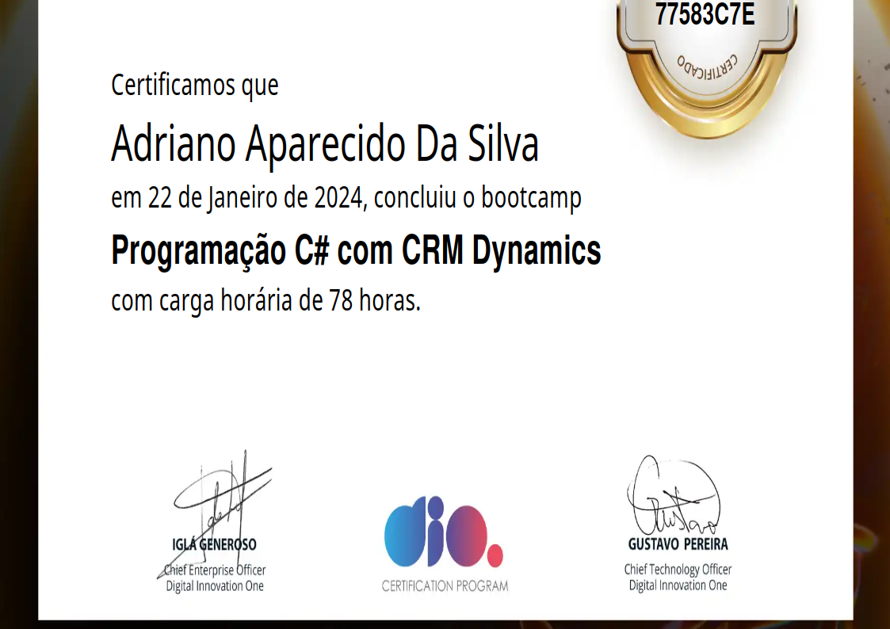

# Bootcamp Dio Coding The Future Avanade - Programação C# com CRM Dynamics 
 
 

Bootcamp Coding The Future Avanade, uma parceria com a multinacional de referência em consultoria tecnológica, Avanade. Programa, que me permitiu conhecer e aprimorar meus conhecimento em programação C# com foco em CRM Dynamics, uma das soluções mais impactantes no mercado corporativo atual.

### Mentorias:
***Ao longo do bootcamp tivemos algumas mentorias com profissionais de peso na área, onde foi posível conhecer mais sobre o assunto e fazer uma ligação mental com o que o merecado de tralhado está buscando nos profissionais.***
- [x] [Live de Lançamento - Programação C# com Dynamics 365](https://www.youtube.com/watch?v=MDZkUu-uz94)
 
Domine as tecnologias utilizadas pelas empresas mais inovadoras do mundo e encare seu novo desafio profissional, evoluindo em comunidade com os melhores experts.
- [x] [Como se Tornar um Profissional de Sucesso na Avanade](https://www.youtube.com/watch?v=B43Tg61_LoU)
 
Descubra os Segredos para o Sucesso Profissional na Avanade. Participe da nossa live e obtenha insights valiosos, dicas práticas e orientações para impulsionar sua carreira na Avanade. Prepare-se para alcançar novos andares como um profissional.
- [x] [Desenvolvimento de Soluções de IA e Machine Learning no Dynamics 365](https://www.youtube.com/watch?v=cjFq2o3HP9E)
 
Explore como incorporar inteligência artificial e aprendizado de máquina em soluções do Dynamics 365 CE para análises avançadas e automação de processos.
- [x] [Colaboração entre Plataformas: Dynamics 365 CE e Integração de Sistemas](https://www.youtube.com/watch?v=6aDyhxbZg5I)
    Esta mentoria foca em como integrar o Dynamics 365 CE com outros sistemas, como sistemas de contabilidade, sistemas de gerenciamento de documentos ou sistemas de terceiros, usando ferramentas como Web API, Azure Logic Apps e Azure Functions.

 
 

   

     
       

